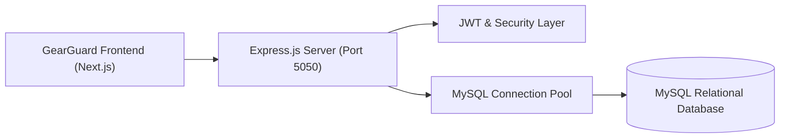
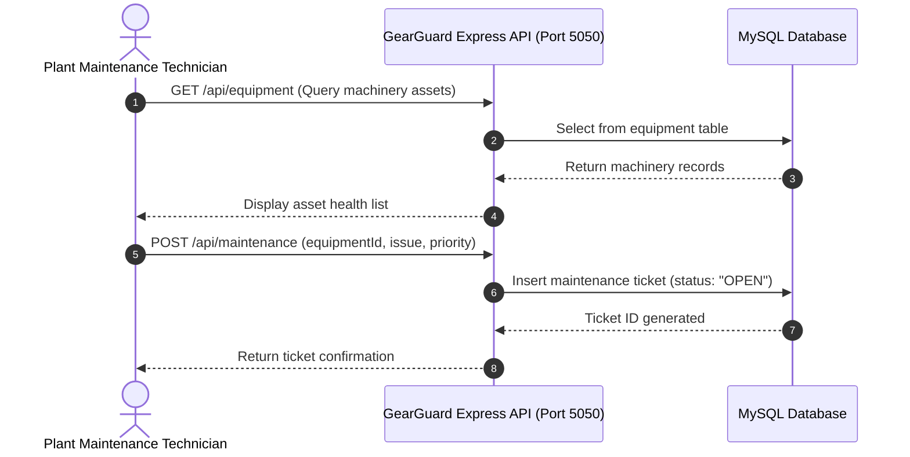

# GearGuard API — Industrial Maintenance Management REST API
[]()
[]()
[]()
[]()

## Overview
GearGuard API is an industrial asset maintenance, repair tracking, and work order dispatch backend built with Node.js, Express, and MySQL. It empowers factory operations and plant managers to log equipment downtime, schedule preventive maintenance inspections, and track technician assignments.

- **Problem Solved:** Unplanned factory equipment downtime and disorganized manual maintenance requests.
- **Target Users:** Plant managers, maintenance technicians, and equipment operators.
- **Current Status:** Functional REST API.

## Features
- **Equipment Asset Registry:** Track machinery serials, purchase dates, warranty statuses, and locations.
- **Maintenance Work Orders:** Create emergency repair or preventive inspection tickets.
- **Technician Scheduling:** Assign work orders to specialized repair technicians.
- **Downtime Telemetry:** Track total downtime hours and Mean Time Between Failures (MTBF).

## Architecture


## User Flow


## Technology Stack
| Layer | Technology | Purpose |
|---|---|---|
| Runtime | Node.js (v18+) | JavaScript execution engine |
| Framework | Express.js | Modular REST API routing |
| Database | MySQL 8.0, mysql2 | Relational asset and work order store |
| Security | bcrypt, jsonwebtoken | Secure access control |

## Infrastructure
- **API Port:** 5050
- **Database Port:** 3306

## Project Structure
```text
Odoo-backend/
├── src/
│   ├── config/          # Database connection (db.js, env.js)
│   ├── controllers/     # equipmentController, maintenanceController, authController
│   ├── routes/          # Express route definitions
│   ├── app.js           # Express middleware setup
│   └── server.js        # Server listener entrypoint
├── .env.example         # Environment template
├── .gitignore           # Git ignore definitions
└── README.md            # Technical documentation
```

## Prerequisites
- Node.js >= 18.x
- MySQL Server 8.0

## Environment Variables
Create `.env` using placeholders:
```env
PORT=5050
DB_HOST=localhost
DB_USER=root
DB_PASSWORD=your_mysql_password
DB_NAME=odoo
JWT_SECRET=your_jwt_secret_key
```

## Local Development Setup
1. Clone the repository:
   ```bash
   git clone https://github.com/Bhanutejanallamothu/Odoo-backend.git
   cd Odoo-backend
   ```
2. Install dependencies:
   ```bash
   npm install
   ```
3. Set up environment:
   ```bash
   cp .env.example .env
   ```
4. Start API server:
   ```bash
   npm start
   ```
5. Server listens on `http://localhost:5050`.

## Docker Setup
*Not detected in repository.*

## Database Setup
```sql
CREATE DATABASE odoo;
```

## API Documentation
- `POST /api/auth/login` - Technician and manager login.
- `GET /api/equipment` - Retrieve machinery asset directory.
- `POST /api/maintenance` - File maintenance request.
- `PUT /api/maintenance/:id/complete` - Mark repair as completed.

## Deployment
Deploy to Render, Railway, or AWS EC2.

## Security
- Credentials externalized from git tracking into `.env`.
- Parameterized database statements.

## Testing
```bash
npm test
```

## Troubleshooting
- Verify MySQL service is listening on port 3306.

## Future Improvements
- IoT telemetry webhook ingestion for automated vibration anomaly alarms.

## License
All rights reserved by repository owner.
